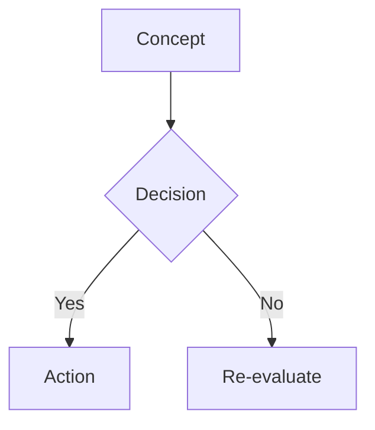

# Agent Content Guidelines (AGENTS.md)

This document provides instructions for AI agents and contributors when creating or updating content for the **CTO Framework** website. Adherence to these guidelines ensures consistency, quality, and relevance for our audience.

## 1. Target Audience
The primary audience is **senior technology leaders**, including:
- Chief Technology Officers (CTOs)
- VPs of Engineering
- Engineering Directors
- Heads of Technology / Engineering
- Staff/Principal Engineers aspiring to leadership

**Tone:** Professional, strategic, concise, and action-oriented. Avoid fluff; focus on high-level impact and decision-making utility.

## 2. Content Structure
Every page should follow this general structure:

- **Frontmatter:** Include a `title` (and `tags` if applicable).
- **Introduction:** A clear, bold definition of the topic.
- **Core Concepts:** Break down the framework, methodology, or technology.
- **Strategic Utility:** Explain *why* it matters to a tech leader (e.g., "Why CTOs should care", "Impact on Delivery").
- **Visuals:** Use Mermaid diagrams whenever a process, hierarchy, or cycle is involved.
- **References:** Always include a section for internal and external links.

## 3. Mandatory Elements

### Tags
Every new page MUST include relevant tags in the frontmatter to support the site's search and discovery features.
```yaml
---
tags:
  - delivery
  - decision-making
  - strategy
---
```

### References
Always ground the content in authoritative sources. **Do NOT link to paywalls or paid content** (e.g., Harvard Business Review, O'Reilly, or subscription-based news sites). Prioritize open-access and free resources.

- **Internal:** Link to related pages within the framework (e.g., `[Iceberg Model](../systems-thinking/iceberg-model.md)`).
- **External:** Include links to:
    - Wikipedia (for general concepts).
    - Academic papers (use open-access versions or DOI links).
    - Official documentation (for technical standards).
    - Authoritative open blogs or community-driven resources.
    - Public GitHub repositories or READMEs.

### Diagrams (Mermaid)
Visual clarity is essential for senior leaders. Use Mermaid code blocks for:
- Flowcharts (processes)
- Sequence diagrams (interactions)
- State diagrams (lifecycles)
- Quadrant charts (prioritisation)

Example:


## 4. Location and Navigation
- Place files in the most relevant subdirectory under `docs/` (e.g., `docs/delivery/`, `docs/people/`, `docs/tech/`, `docs/finance/`, `docs/product/`).
- Use kebab-case for filenames (e.g., `ooda-loop.md`).
- Ensure the page is discoverable via index pages or related content links.

## 5. Style Checklist
- [ ] Is the language appropriate for a C-level executive?
- [ ] Are there enough internal and external references?
- [ ] is there a Mermaid diagram where it makes sense?
- [ ] are the tags correctly defined in the frontmatter?
- [ ] Does it provide actionable insights rather than just theory?
