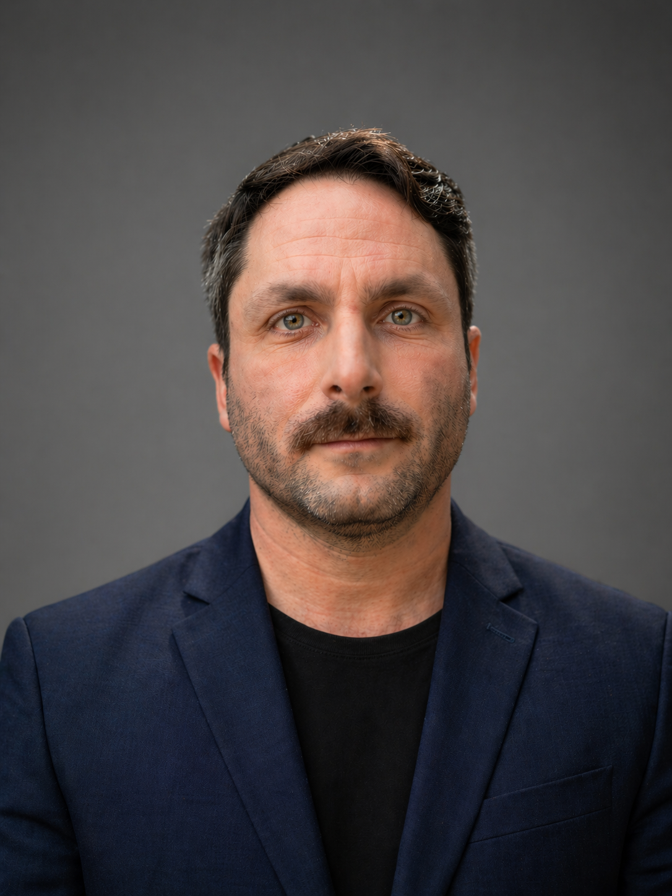

# About the author

{ align=left width="200" style="margin-right: 20px; border-radius: 8px;" }

Santiago Lizardo is an experienced technology leader with a proven track record of driving innovation, business growth, and strategic value through software engineering and product development. Based in Scotland, UK, he specializes in building transformative products, scaling engineering teams, and fostering a high-performance, continuously learning culture in fast-growing organizations.

With over two decades of experience spanning various technical and leadership roles, Santiago currently serves as the **Head of R&D at Zonal**, where he founded and scaled a new R&D organization from the ground up. His work focuses on accelerating time-to-market for new products, establishing engineering excellence, and shaping the architectural vision to align technical direction with strategic business goals.

Prior to his current role, Santiago was the Head of Engineering at Landmark Information Group, leading an organization of approximately 100 engineers. There, he spearheaded technical transformations, introduced modern engineering practices such as feature flagging and static analysis, and standardized agile delivery methodologies to ensure consistent and scalable outcomes.

His extensive background also includes significant tenure as a Senior Engineering Manager at SolarWinds, where he directed technical strategy for global teams and drove migrations to event-driven architectures. As an entrepreneur, Santiago was the CTO & Founder of Netfoe, a vulnerability management startup, and previously co-founded an e-assessment product. Earlier in his career, he held positions as a Technical Director, Software Architect, and Technology Consultant, consistently contributing to engineering standards and product modernization.

Santiago's leadership is underpinned by a robust academic foundation in Software Engineering, Mathematics, and Statistics, complemented by advanced studies in Data Analytics for Business Decision Making and Leadership, Strategy & Innovation. He also holds various professional certifications in cloud architecture (AWS), agile methodologies (SAFe, Scrum), and machine learning.

**Connect with Santiago:**

- [LinkedIn](https://www.linkedin.com/in/santiagolizardo/)
- [GitHub](https://github.com/santiagolizardo)
