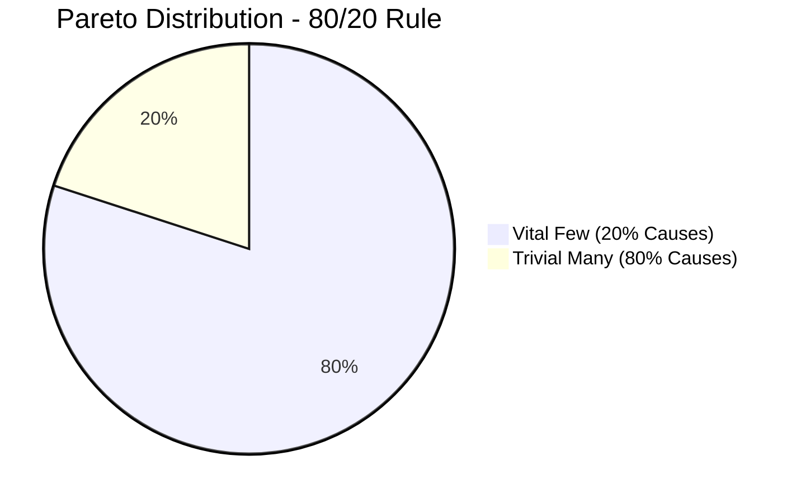

# Pareto Analysis

**Pareto Analysis**, often known as the **80/20 rule**, is a decision-making technique used to identify the most significant factors contributing to a problem or outcome. It’s based on the principle that **roughly 80% of effects come from 20% of causes**.

## Purpose

The goal is to focus resources and efforts on the issues that will have the greatest impact when resolved.

## How It Works

1. **Identify Problems or Causes**: List all contributing factors to a particular outcome (e.g., defects, delays, support tickets).
2. **Measure Frequency or Impact**: Quantify how often each factor occurs or how much impact it has.
3. **Rank in Descending Order**: Sort the causes from most to least significant.
4. **Calculate Cumulative Impact**: Work out the cumulative percentage each cause contributes to the total.
5. **Identify the “Vital Few”**: Typically, the top 20% of causes are responsible for 80% of the effect. These are the priorities for action.

## Application Example

If analysing recurring production issues, a Pareto chart might reveal that just a handful of root causes (e.g. a specific dependency, a misconfigured environment) account for the majority of incidents. By focusing on these, teams can reduce issues significantly with minimal effort compared to addressing all problems equally.

## Tools

This analysis is often visualised using a **Pareto chart**—a bar graph combined with a line graph showing cumulative percentage. It helps in communicating findings clearly and driving consensus on where to allocate effort.

## Benefits

- Enhances decision-making by focusing on high-impact areas.
- Improves efficiency in resource allocation.
- Supports continuous improvement initiatives by highlighting recurring issues.

Pareto Analysis helps align efforts with measurable outcomes, making it easier to prioritise what matters most.

## External resources

- [Wikipedia](https://en.wikipedia.org/wiki/Pareto_principle)
