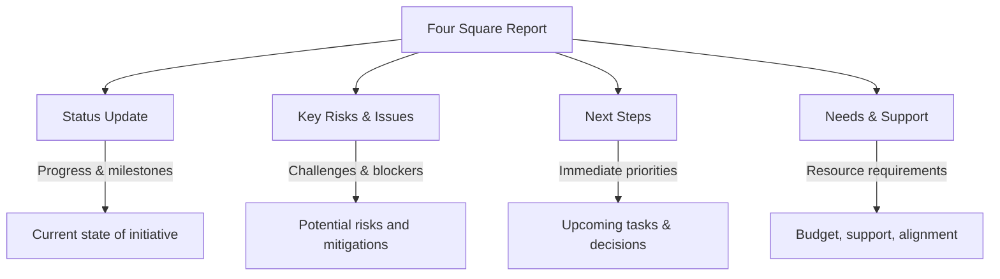

# Four Square Reports

Four Square Reports are a strategic tool used for evaluating and communicating key insights about technology initiatives, projects, or products. They provide a structured, high-level summary using four quadrants, making them useful for decision-making and stakeholder communication.

## Structure

1. **Status Update** – This section summarizes the current state of the initiative, including progress, milestones achieved, and any critical developments.
2. **Key Risks & Issues** – Highlights potential risks, blockers, or technical challenges that could impact delivery, along with mitigation strategies.
3. **Next Steps** – Outlines immediate priorities, upcoming tasks, and key decisions required to maintain momentum.
4. **Needs & Support** – Identifies specific asks, whether related to budget, resources, or leadership alignment, to ensure successful execution.

