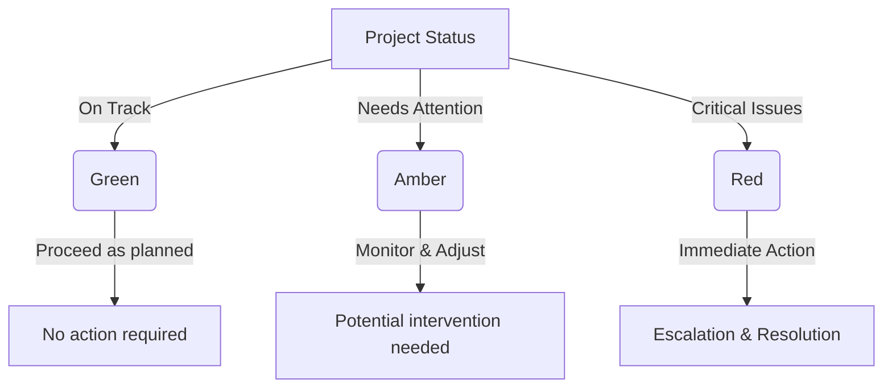

# RAG Reports

RAG (Red, Amber, Green) reports are a visual management tool used to quickly assess the status of projects, initiatives, or key performance areas. Each color represents a different level of progress or risk:

- **Red**: Indicates critical issues that require immediate attention. This could mean a project is significantly off track, resources are insufficient, or major risks have materialized.
- **Amber**: Signals caution—while progress is being made, there are concerns that could escalate without intervention. It suggests that corrective actions may be needed.
- **Green**: Represents smooth progress, with no major risks or blockers. Everything is on track according to plan.

These reports help decision-makers prioritize actions, allocate resources effectively, and communicate status clearly across teams and stakeholders. By regularly reviewing RAG statuses, organizations can proactively address risks and maintain alignment with strategic goals.
