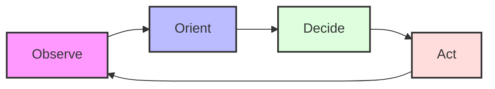

---
tags:
  - delivery
  - decision-making
  - systems-thinking
---

# OODA Loop

The **OODA Loop** (Observe, Orient, Decide, Act) is a four-step cycle for making decisions in high-stakes, rapidly changing environments. Developed by military strategist and United States Air Force Colonel **John Boyd**, it focuses on filtering information, putting it into context, and acting quickly to gain a competitive advantage.

In technology leadership, the OODA loop is a powerful framework for incident response, product iteration, and strategic maneuvering.

## **The Four Stages**

### 1. **Observe**
Gather raw data from all available sources. This includes metrics, logs, user feedback, market trends, and team observations. The goal is to build the most accurate picture possible of the current situation.

### 2. **Orient**
This is the most critical stage. It involves processing observations through the lens of your experience, culture, existing knowledge, and mental models. Orientation helps you filter out noise, identify patterns, and understand the implications of the data.

### 3. **Decide**
Based on your orientation, choose a course of action. This stage is about formulating a hypothesis or a plan, acknowledging that you will never have 100% of the information.

### 4. **Act**
Carry out the decision and test your hypothesis. The results of this action immediately become new data for the next **Observe** phase, restarting the cycle.

## **Visualising the OODA Loop**

## **Applications in Technology Leadership**

*   **Incident Management:** When a production system goes down, the team must rapidly *observe* the symptoms, *orient* themselves by checking logs and recent changes, *decide* on a fix or rollback, and *act* to restore service.
*   **Product Development:** The OODA loop is similar to the **Build-Measure-Learn** loop in Lean Startup. It emphasizes moving fast to learn from the market.
*   **Competitive Strategy:** By accelerating your OODA loop, you can "out-cycle" competitors—reacting to market changes before they have even finished their orientation.

## **Key Principles**
*   **Speed is Relative:** You don't need to be fast in an absolute sense; you just need to be faster than your opponent or the rate of change in your environment.
*   **Embrace Uncertainty:** The loop is designed to handle imperfect information.
*   **Continuous Feedback:** Every action provides new information to refine the next cycle.

## **References**
* [Wikipedia: OODA loop](https://en.wikipedia.org/wiki/OODA_loop)
* [Systems Thinking Iceberg Model](iceberg-model.md)
