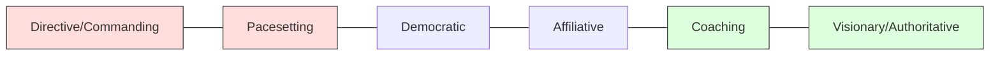

# Leadership Styles

For a CTO or senior technology leader, leadership is not about a single fixed approach. It is about having a repertoire of styles and the situational awareness to switch between them as the environment demands—whether navigating a production crisis, mentoring a future VP of Engineering, or defining a multi-year technology strategy.

## **The Leadership Spectrum**

Effective leaders balance high-pressure "Pacesetting" and "Commanding" styles with long-term "Coaching" and "Affiliative" styles.

## **Key Styles for Tech Leaders**

### 1. **The Visionary (Authoritative)**
The leader moves people toward a shared vision.

- **When to use:** When a new direction or a clear "North Star" is needed (e.g., migrating to a new architecture, company pivot).
- **CTO Context:** Defining the "why" behind technical choices to align disparate engineering teams.

### 2. **The Coaching Leader**
Focuses on long-term professional development.

- **When to use:** To help high-potential engineers or managers build long-term strengths.
- **CTO Context:** Building a succession plan for the engineering leadership team.

### 3. **The Democratic Leader**
Forges consensus through participation.

- **When to use:** To build buy-in or to get valuable input from domain experts.
- **CTO Context:** Selecting a new core technology stack where team adoption is critical.

### 4. **The Pacesetting Leader**
Sets high standards for performance and exemplifies them.

- **When to use:** To get quick results from a highly motivated and competent team.
- **CTO Context:** Deep-diving into a critical "tiger team" project to hit a hard deadline. *Warning: Can lead to burnout if overused.*

### 5. **The Affiliative Leader**
Creates harmony and builds emotional bonds.

- **When to use:** To heal rifts in a team or to motivate people during stressful circumstances.
- **CTO Context:** Post-incident recovery or during a restructuring phase.

### 6. **The Commanding (Coercive) Leader**
Demands immediate compliance.

- **When to use:** In a crisis, to kick-start a turnaround, or with problem employees.
- **CTO Context:** A major security breach or total site outage where clear, top-down direction is required.

## **Strategic Utility**

A CTO's effectiveness is often measured by their **Situational Leadership**—the ability to assess the maturity of the team and the urgency of the task to pick the right style. Over-reliance on pacesetting is a common "trap" for technical founders transitioning to C-level roles.

## **Summary of Leadership Styles**

| Style | Description | Best For |
| :--- | :--- | :--- |
| **Visionary** | Moves people toward a shared vision. | Strategic pivots, new architecture. |
| **Coaching** | Focuses on long-term development. | Mentoring high-potentials. |
| **Democratic** | Forges consensus through participation. | Building buy-in for tech choices. |
| **Affiliative** | Creates harmony and builds bonds. | Post-incident recovery, morale boosts. |
| **Pacesetting** | Sets high standards for performance. | High-competence teams on deadlines. |
| **Commanding** | Demands immediate compliance. | Crisis management, outages. |
| **Transformational** | Inspires through enthusiasm and vision. | Startups, change-driven culture. |
| **Servant** | Prioritizes team needs and growth. | Team-centric, high-trust environments. |
| **Laissez-Faire** | Minimal supervision; high autonomy. | Highly skilled, self-motivated teams. |

## **References**

- [Wikipedia: Situational Leadership Theory](https://en.wikipedia.org/wiki/Situational_leadership_theory)
- [Goleman's Leadership Styles (Summary)](https://www.kornferry.com/insights/this-week-in-leadership/leadership-styles-goleman)
