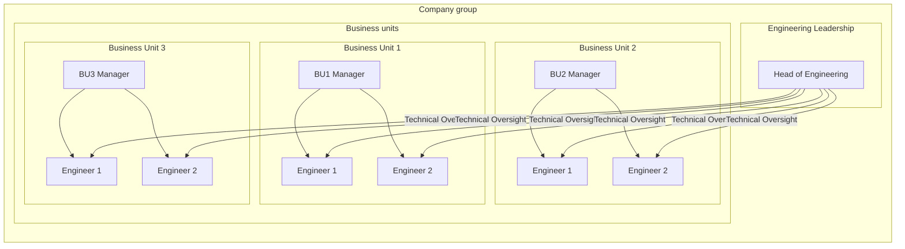

# Matrix Organisations

A **matrix organisation** is a structure that blends functional and project-based hierarchies, enabling employees to report to multiple leaders. This approach is particularly relevant in technology-driven environments where cross-functional collaboration is essential.

## Key Characteristics of a Matrix Organisation

1. **Dual Reporting Lines** – Employees typically report to both a functional manager (e.g., head of software engineering) and a project or product manager. This ensures deep expertise in their discipline while also aligning work with business goals.
2. **Cross-Functional Collaboration** – Teams are formed by pulling specialists from different departments (e.g., developers, designers, security experts) to work together on projects. This encourages innovation and agility.
3. **Resource Efficiency** – Instead of siloed departments, skills and resources are dynamically allocated where they are needed, reducing redundancies and improving flexibility.
4. **Scalability and Adaptability** – The structure allows businesses to scale effectively by assigning resources based on priority projects rather than rigid departmental constraints.
5. **Potential Challenges** – Matrix organisations can lead to conflicts in priorities, as employees juggle multiple responsibilities. Clear communication and well-defined roles are crucial to mitigating this.

## Application in a Technology-Driven Environment

- Encourages **rapid iteration and continuous delivery** by aligning technical talent with business objectives.
- Enables **specialists to contribute across multiple initiatives**, increasing efficiency.
- Supports **agile methodologies**, as teams can form and dissolve as needed based on project requirements.

This structure is widely used in modern organisations, particularly in those balancing **technical expertise** with business needs while maintaining **agility and innovation**.
