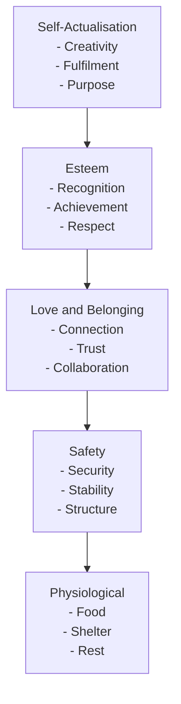

# Maslow’s Hierarchy of Needs: A Framework for Human Motivation

Maslow’s Hierarchy of Needs is a foundational psychological model that describes the stages of human motivation. Presented as a five-level pyramid, each layer represents a category of needs, progressing from the most basic physiological requirements to more complex psychological and self-fulfilling aspirations.

Understanding this framework helps create environments where individuals are not only more engaged but also capable of high performance, innovation, and sustained contribution.

---

## **1. Physiological Needs**

These are the most basic human needs required for survival:

- Food, water, air, sleep
- Shelter and clothing
- Rest and basic comfort

### **Organisational Relevance:**

In professional environments, these translate to:

- A physically safe and accessible workspace
- Fair and timely compensation
- Access to amenities (e.g. rest areas, clean facilities, food options)

When unmet, these foundational needs consume mental energy, reducing cognitive capacity for strategic, creative, or collaborative work.

---

## **2. Safety Needs**

Once the basics are met, individuals seek security and predictability in their environment.

- Physical safety (freedom from harm or threat)
- Financial security
- Health and wellbeing
- Structure and routine

### **Organisational Relevance:**

This can take the form of:

- Job security and predictable workloads
- Transparent policies and governance
- Ethical leadership and risk management
- Access to healthcare and support programmes

People are far more likely to commit and perform when they feel safe from disruption, instability, or personal risk.

---

## **3. Love and Belonging**

Humans are inherently social beings, and connection is essential for motivation.

- Friendships and family ties
- A sense of community
- Acceptance and trust

### **Organisational Relevance:**

This manifests in:

- Psychological safety and inclusive culture
- Strong team dynamics and collaborative practices
- Healthy relationships with peers and leaders
- Engagement rituals like social events or peer recognition

Belonging enhances loyalty, morale, and willingness to contribute beyond baseline expectations.

---

## **4. Esteem Needs**

This level involves the need for:

- Respect from others
- Recognition of achievements
- Mastery and competence
- Autonomy and influence

### **Organisational Relevance:**

Support esteem by offering:

- Regular recognition (formal and informal)
- Opportunities for advancement and professional growth
- Constructive feedback and coaching
- Meaningful decision-making autonomy

Recognition fuels performance. When people feel competent and valued, they’re more likely to lead, innovate, and take ownership.

---

## **5. Self-Actualisation**

At the peak of the hierarchy is the desire to fulfil one's potential:

- Pursuit of creativity, innovation, and purpose
- Self-directed growth and learning
- Contribution to a greater cause

### **Organisational Relevance:**

To support self-actualisation, provide:

- Opportunities to lead purpose-driven initiatives
- Room to experiment and innovate without fear of failure
- Access to mentorship and lifelong learning
- Alignment between personal values and organisational mission

At this level, individuals move from "What can I do to succeed?" to "What impact can I create?" They operate with autonomy, passion, and strategic foresight.

## External resources

- [Wikipedia](https://en.wikipedia.org/wiki/Maslow%27s_hierarchy_of_needs)
