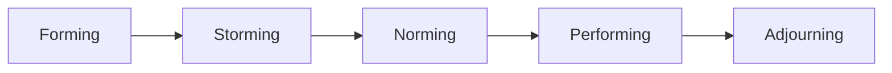

#

## Stages of group development

The Stages of Group Development model, proposed by psychologist Bruce Tuckman in 1965, describes how teams evolve over time. The five stages are:

### Forming (Getting to Know Each Other)

- Team members are introduced and get acquainted.
- Roles and responsibilities are unclear.
- There’s politeness, excitement, and sometimes anxiety.
- Leaders need to provide direction and set expectations.

### Storming (Conflict and Power Struggles)

- Differences in opinions, work styles, and personalities emerge.
- Conflicts, resistance, or competition for roles may arise.
- Communication can be challenging.
- Leaders should facilitate open discussion and conflict resolution.

### Norming (Establishing Ground Rules & Collaboration)

- Team members start cooperating and resolving differences.
- Clear roles, responsibilities, and norms are established.
- Trust and team cohesion improve.
- Productivity increases as members focus on goals.

### Performing (High Functioning Team)

- The team is fully cohesive, autonomous, and highly productive.
- Members work efficiently towards common goals with minimal supervision.
- Creativity and problem-solving thrive.
- Leaders provide motivation and guidance rather than direct control.

### Adjourning (Project Completion & Dissolution) (Added later in 1977)

- The team disbands after achieving its goals.
- Members reflect on their journey, celebrate achievements, and move on.
- Some may experience a sense of loss or transition.

Each team moves through these stages at different speeds, and sometimes they may regress (e.g., returning to storming when new challenges arise). Strong leadership and team dynamics help navigate these stages effectively.

## References

- [Tuckman's stages of group development](https://en.wikipedia.org/wiki/Tuckman%27s_stages_of_group_development)
- [Drexler/Sibbet Team Performance Model](https://coachpedropinto.com/drexler-sibbet-team-performance-model/)
