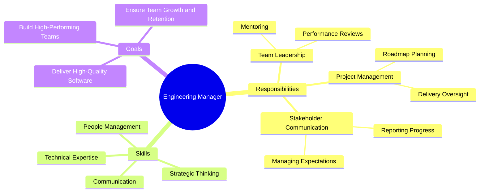

# Mind Maps: A Visual Framework for Organising Ideas

A mind map is a **visual framework** for organising and exploring information in a **non-linear way**. It starts with a **central concept or problem** placed at the centre of a diagram. From there, **key ideas branch out like nodes**, and each node can further expand into sub-branches, representing related concepts, tasks, or data points.

Unlike traditional lists or documents, which enforce a **top-down, sequential structure**, mind maps are designed to **mirror how humans naturally process and connect ideas**. They allow for the integration of **hierarchical relationships** (parent-child structures) and **associative links**, making them ideal for both high-level strategy and granular detail.

---

## Key Characteristics

- **Radial structure**: Information radiates from a single central theme, giving immediate context and showing relationships at a glance.
- **Hierarchy and associations**: Primary branches represent core topics, while secondary and tertiary branches represent details or related ideas.
- **Visual cues**: Colours, icons, and spatial positioning can add an extra layer of meaning, helping with memory and prioritisation.

---

## Practical Benefits

- **Clarity in complexity**: Quickly reveals interdependencies and gaps in understanding.
- **Faster ideation**: Supports brainstorming by allowing ideas to emerge organically.
- **Efficient planning**: Serves as a blueprint for structuring projects, strategies, or workflows before committing to linear documentation.

---

## Example: Role of an Engineering Manager (Mind Map)

## External resources

- [Wikipedia](https://en.wikipedia.org/wiki/Mind_map)
