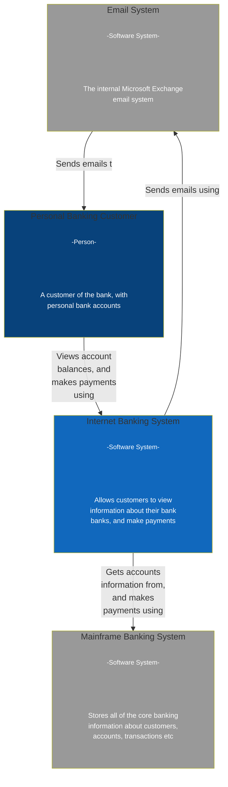
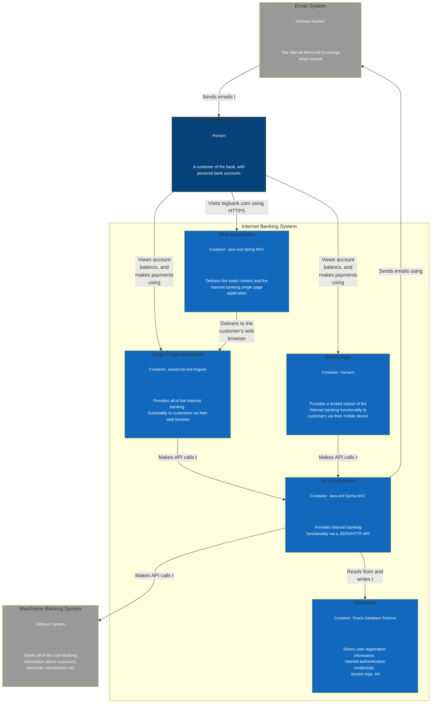
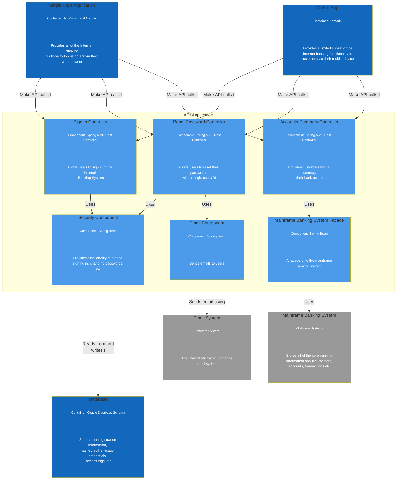
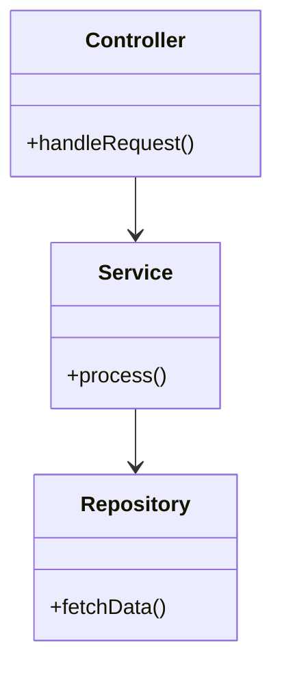

# The C4 Model: Visualising Software Architecture

The C4 Model, created by [Simon Brown](https://c4model.com), is a structured approach to visualising software architecture across multiple levels of detail. It provides a clear and consistent way to describe the static structure of a system in a way that is understandable by both technical and non-technical stakeholders.

The name **C4** stands for four hierarchical diagram types:

1. **Context**
2. **Container**
3. **Component**
4. **Code**

This model supports better communication, documentation, and design discussions, particularly in complex, distributed systems.

---

## 1. System Context Diagram

The **System Context Diagram** shows the system in scope and how it interacts with users and other systems. It answers the question: _"What does the system do, and who does it interact with?"_

### Purpose:

- High-level overview for all audiences.
- Helps frame the boundaries and relationships of the system.

---

## 2. Container Diagram

The **Container Diagram** zooms into the system, showing the main containers (applications, services, databases, etc.) and how they interact. A container here is something that executes code or stores data.

### Purpose:

- Understand the technology stack and responsibilities.
- Clarify how the system is decomposed at a high level.

_Note: In a full C4 diagram, these containers would be drawn within a system boundary box to indicate they belong to the same system._

---

## 3. Component Diagram

The **Component Diagram** drills down into a single container, detailing its internal components (services, modules, controllers, etc.) and their relationships.

### Purpose:

- Understand the major building blocks of a container.
- Support modularity and team boundaries.

---

## 4. Code (Class) Diagram

The **Code Diagram** is the most granular level, usually auto-generated. It shows the internal structure of a component using classes, interfaces, and their relationships.

### Purpose:

- Reference for developers.
- Explores implementation-level detail.

---

## Why Use C4?

- Encourages **clear communication** across teams.
- Helps **standardise documentation** practices.
- Adaptable for various audiences — from business leaders to engineers.
- Complements agile and DevOps practices by making architecture _visible_ and _evolvable_.

---

## Summary

| Level     | Focus                               | Audience                          |
| --------- | ----------------------------------- | --------------------------------- |
| Context   | External interactions               | Broad (technical + non-technical) |
| Container | Applications & data stores          | Architects, engineers             |
| Component | Logical structure within containers | Engineers, developers             |
| Code      | Class-level detail                  | Developers                        |

## References

- [Wikipedia](https://en.wikipedia.org/wiki/C4_model)
