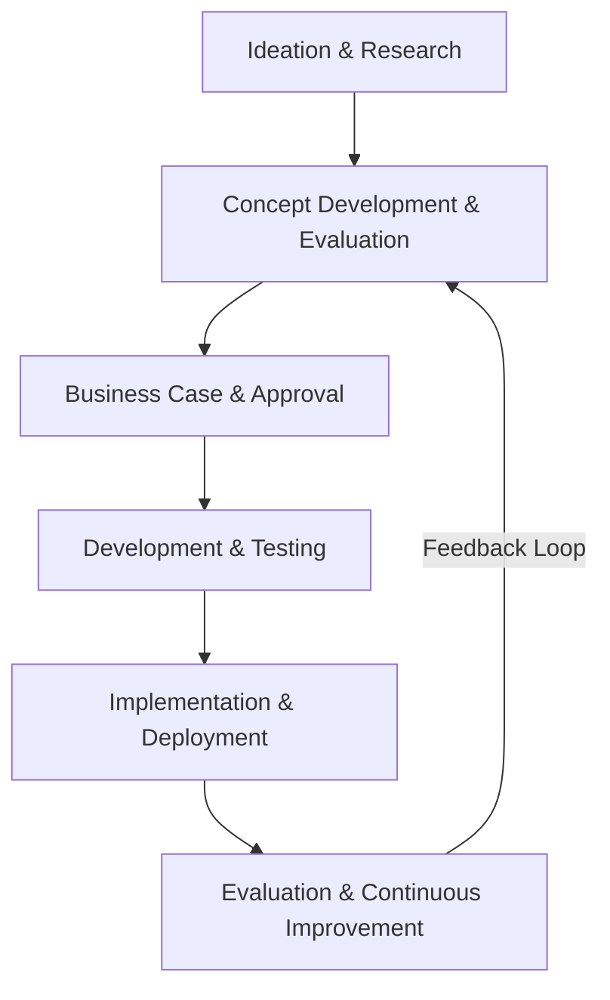

# New Technology Introduction (NTI) Process

The **New Technology Introduction (NTI) process** ensures a smooth transition from concept to implementation while minimizing risks, costs, and disruptions.

## **1. Ideation & Research**

- Identify a need, problem, or opportunity that the technology will address.
- Conduct market research, feasibility studies, and competitor analysis.
- Assess emerging technologies and potential solutions.

## **2. Concept Development & Evaluation**

- Define the technology’s scope, goals, and benefits.
- Develop prototypes, proof of concepts (PoCs), or minimum viable products (MVPs).
- Conduct risk assessments, including technical, financial, and regulatory factors.
- Gather stakeholder feedback and refine the concept.

## **3. Business Case & Approval**

- Create a business case outlining costs, benefits, ROI, and risks.
- Secure executive or stakeholder buy-in and funding.
- Align the new technology with business goals and regulatory compliance.

## **4. Development & Testing**

- Build the technology or integrate it with existing systems.
- Conduct iterative testing (unit, integration, performance, security).
- Pilot deployment in a controlled environment.

## **5. Implementation & Deployment**

- Develop a rollout strategy (phased, parallel, or full deployment).
- Provide training and documentation for end-users and IT teams.
- Monitor adoption rates and address issues in real-time.

## **6. Evaluation & Continuous Improvement**

- Gather user feedback and performance metrics.
- Identify areas for optimization and potential upgrades.
- Plan for scaling, maintenance, and future iterations.
