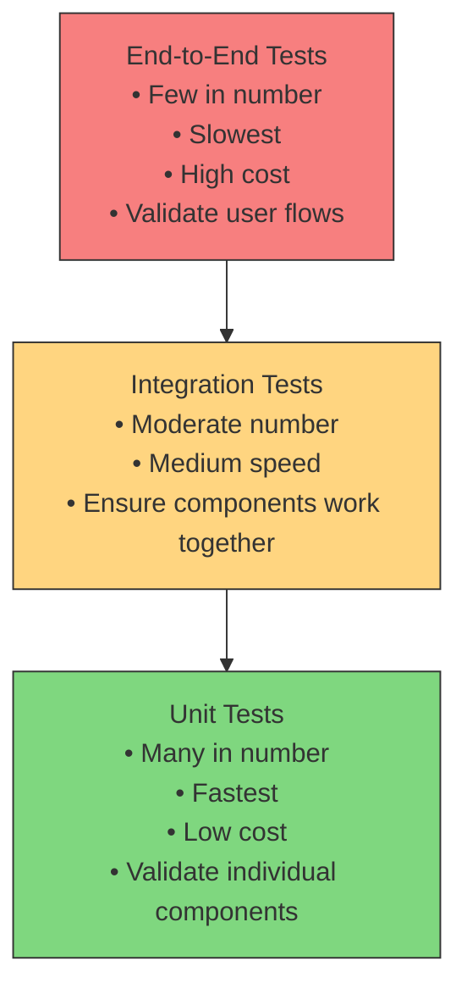

# The Test Pyramid

The **Test Pyramid** is a conceptual model that illustrates how to structure automated tests to achieve both efficiency and confidence in software quality. It highlights the importance of balancing different levels of testing to reduce cost, improve speed, and maintain reliability.

---

## Layers of the Pyramid

### 1. **Unit Tests (Base Layer)**

- **Scope:** Small, isolated pieces of code such as functions or classes.
- **Characteristics:** Fast to run, inexpensive to maintain, high in number.
- **Purpose:** Validate individual components to catch defects early and provide immediate feedback.

### 2. **Integration Tests (Middle Layer)**

- **Scope:** Interactions between multiple components or services.
- **Characteristics:** Slower than unit tests, fewer in number, moderate maintenance cost.
- **Purpose:** Ensure that integrated parts work together as expected.

### 3. **End-to-End (E2E) Tests (Top Layer)**

- **Scope:** Entire application flow, from user interface down to the backend and databases.
- **Characteristics:** Slowest to execute, highest cost, fewest in number.
- **Purpose:** Validate the system from a user perspective to ensure critical paths function correctly.

---

## Why the Pyramid Shape?

- **Wide Base:** Many fast, cheap unit tests provide strong coverage at a low cost.
- **Narrow Top:** Only a small number of end-to-end tests are needed to verify high-level behaviour.
- **Efficiency:** Testing effort and time decrease as you move up the pyramid.

---

## Benefits of Applying the Test Pyramid

- **Speed:** Quick feedback loops due to the prevalence of fast tests.
- **Reliability:** Reduced flakiness by minimising heavy end-to-end tests.
- **Cost-Effectiveness:** Lower maintenance overhead and fewer test environment complexities.
- **Confidence in Releases:** Balanced test strategy increases trust in deployments.

---

## Common Anti-Pattern: The Inverted Pyramid

- Heavy reliance on end-to-end tests with insufficient unit or integration tests.
- Leads to slow feedback, brittle tests, and higher costs.

---

## Summary

The Test Pyramid encourages a testing strategy that:

- Builds a strong foundation of unit tests.
- Supplements with a moderate layer of integration tests.
- Caps with a small set of end-to-end tests.

This layered approach results in faster, more reliable, and more maintainable testing practices.
